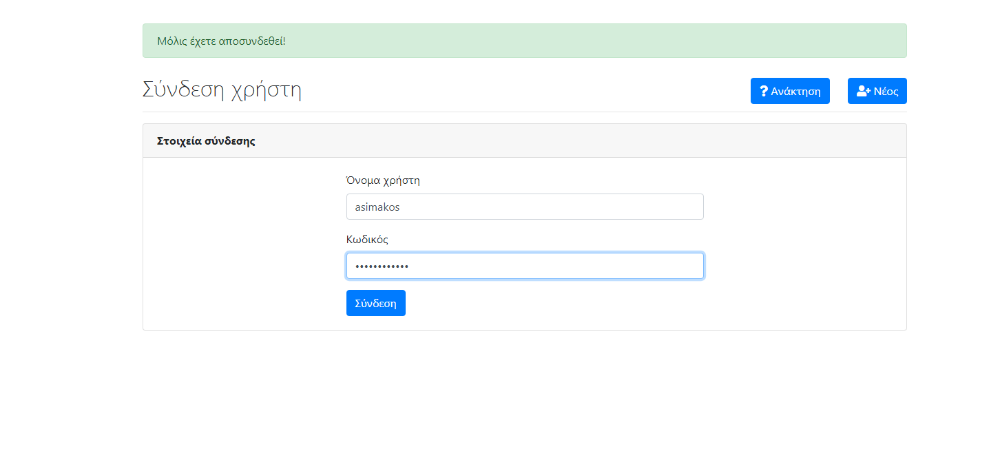
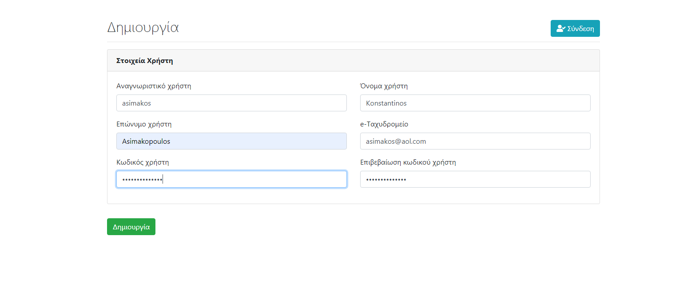
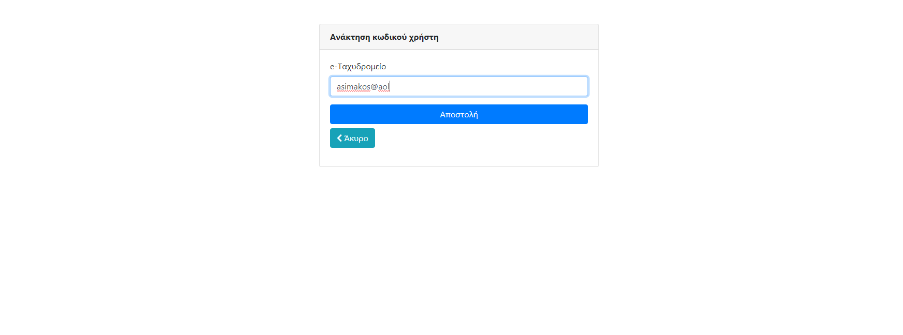
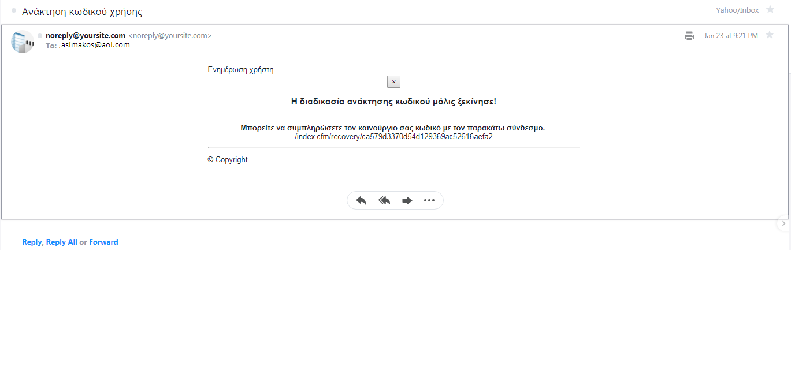
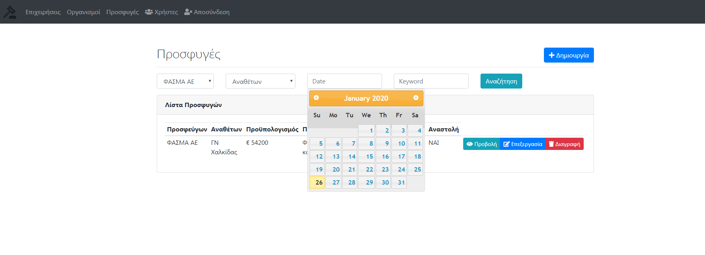
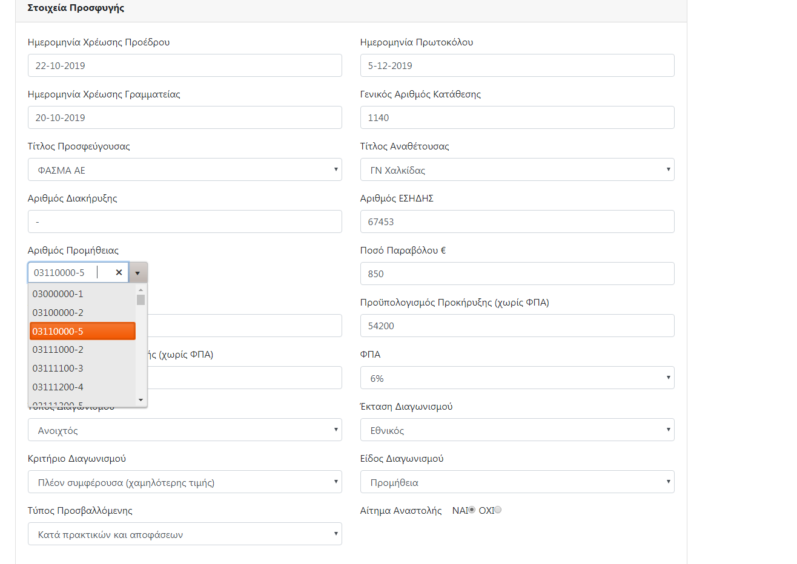

		                                 Prejudicial appeals  Registry  

A CRUD cfwheels app where the user is able to register significant information for prejudicial appeals as well as for its own participants especially private companies and public organizations as distinct registries. The user has also the ability to search for prejudicial appeal information according to specific criteria such as submission date of prejudicial appeal, selection of a specific private company or public organization and specific identification prejudicial appeal number (ΓΑΚ).

This app provides a login screen for authentication of existing users, registration screen for new users after receiving a notification email for account activation to a specific-app web link and password retrieval screen in case of password loss after receiving a notification email for entering new password to a specific-app web link.

This app has been made via [cfwheels 2.x framework](https://cfwheels.org/), [Boostrap](https://getbootstrap.com/), [fontawesome icons](https://fontawesome.com/), MySQL as DBMS, [Kendo-ui core](https://www.telerik.com/kendo-ui/open-source-core), [SendGrid email API](https://sendgrid.com/) and [Bootstrap email template](https://github.com/advancedrei/BootstrapForEmail). 
[Commandbox](https://commandbox.ortusbooks.com/setup/download) is required to be installed for its successful operation as well as for [Lucee server 5.x](https://lucee.org/) installation and successful service.

**Login view**

**Register view**

**Retrieve password view**

**Retrieve email notification view**

**General prejudicial appeals view**

**Edit prejudicial appeal view**

